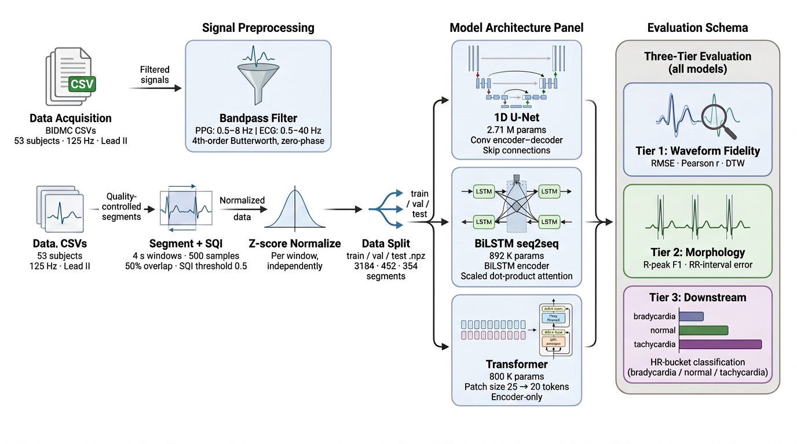
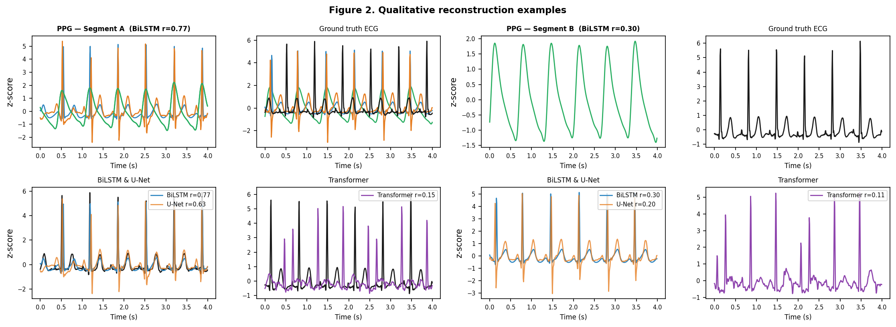
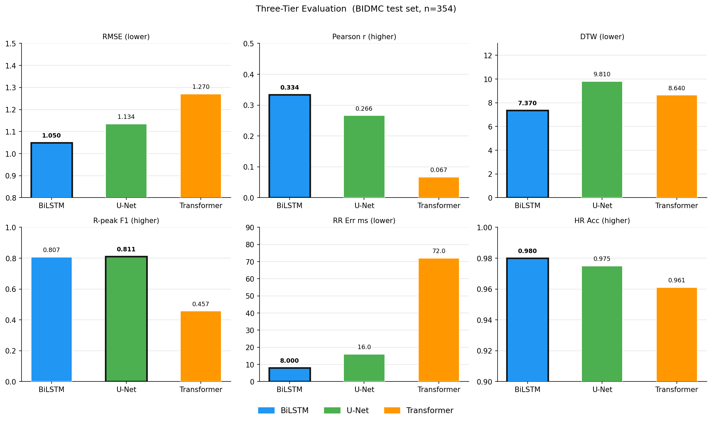

# PPG-to-ECG Synthesis: A Comparative Study of CNN, Recurrent, and Transformer Architectures

**Mahad Khaliq**
CMP_SCI 8770 — Intro to Neural Networks, Spring 2026
University of Missouri-Columbia

---

## Introduction

The electrocardiogram (ECG) is the primary clinical tool for arrhythmia screening, ischemic event detection, and cardiac rhythm analysis. It requires chest or limb electrodes and a trained operator to acquire. Photoplethysmography (PPG), by contrast, measures blood volume changes optically through the skin and is recorded passively by consumer smartwatches, pulse oximeters, and smartphone cameras. Hundreds of millions of people produce PPG signals continuously, while ECG recording remains far less accessible outside of clinical settings.

Reconstructing ECG from PPG would extend ECG-derived diagnostics to the population that already wears optical sensors but has no access to electrode-based recording. The two signals share a common cardiac source: each heartbeat produces both an electrical wavefront (visible in ECG as the P-QRS-T complex) and a pressure pulse that travels to the fingertip (visible in PPG as a smooth systolic peak). The reconstruction problem is cross-modal signal translation with a fixed temporal offset between the two modalities.

The difficulty is that ECG morphology encodes patient-specific electrical properties of the myocardium that PPG does not directly measure. The P-wave, QRS duration, and T-wave amplitude depend on conduction velocity, cardiac axis, and ventricular wall thickness. A PPG waveform from two patients with identical heart rates can map to ECG waveforms with substantially different morphologies. Any reconstruction model therefore faces a fundamental ambiguity: given a PPG segment, many ECG waveforms are consistent with it. L1-trained regressors respond to this ambiguity by outputting the conditional mean, which preserves beat timing but averages out morphological detail.

Sarkar and Etemad introduced CardioGAN [1], a GAN-based approach that produced visually sharper ECG reconstructions by adversarially penalising blurry outputs. Subsequent work has proposed Wasserstein objectives [9], patient-specific conditioning [10], and most recently diffusion-based synthesis [15,16]. These studies demonstrate that reconstruction is feasible, but they use different datasets, split strategies, and evaluation metrics, making direct comparison difficult.

This study trains a 1D U-Net, a BiLSTM sequence-to-sequence model with scaled dot-product attention, and a patch-based Transformer encoder on the same BIDMC dataset [7,8] under identical conditions. We evaluate all three models using a three-tier protocol covering waveform fidelity, morphological preservation, and downstream heart-rate classification. The goal is a controlled comparison that exposes the practical tradeoffs between architectural families on a small-scale ECG reconstruction task.

---

## Related Work

**PPG-to-ECG synthesis.** CardioGAN [1] was the first systematic study of PPG-to-ECG reconstruction, training an attentive generator with a dual discriminator on the BIDMC corpus. P2E-WGAN [9] replaced the standard GAN objective with a Wasserstein loss. PPG2ECGps [10] added subject-aware conditioning. Zhu et al. [17] explored cycle-consistent training to jointly learn the forward and inverse mappings. The RDDM diffusion model [15] and PPGFlowECG [16] represent the current state of the art in reconstruction fidelity, but both require substantially longer training and inference compared to the regression-based architectures studied here.

**Convolutional encoder-decoders.** The U-Net architecture [3], originally developed for biomedical image segmentation, adapts naturally to one-dimensional signals by replacing 2D convolutions with 1D equivalents. Skip connections between encoder and decoder stages allow fine-grained temporal features to bypass the bottleneck, which is particularly important for preserving high-frequency ECG features such as QRS peak sharpness. Several recent biosignal reconstruction studies have found 1D U-Net to be a strong baseline [18].

**Recurrent sequence-to-sequence models.** Sutskever et al. [4] established the encoder-decoder LSTM framework for sequence-to-sequence problems. Bahdanau et al. [5] added soft attention over encoder outputs, allowing the decoder to selectively weight different input timesteps. For ECG reconstruction specifically, the dependency between the PPG systolic peak and the corresponding ECG QRS complex makes attention useful. We use scaled dot-product attention rather than the original additive formulation for memory efficiency at sequence length 500.

**Transformer models for biosignals.** Vaswani et al. [2] introduced multi-head self-attention as a general sequence modelling primitive. PatchTST [19] demonstrated that patching a long time series before applying a Transformer is more data-efficient than token-per-timestep approaches. The Performer model [14] applied patch-based Transformers specifically to PPG-to-ECG reconstruction on the BIDMC dataset, reporting competitive RMSE. We follow the same patching scheme with patch size 25, producing 20 tokens per 500-sample window.

**Evaluation methodology.** Hannun et al. [6] established the approach of testing a downstream classifier trained on real ECG against synthesised signals as a clinically motivated fidelity proxy. We adopt this alongside standard waveform metrics because signal-level correlation and clinically meaningful rhythm preservation can diverge substantially.

---

## Data

We use the BIDMC PPG and Respiration Dataset [7,8], which contains simultaneous PPG and ECG recordings from 53 ICU patients sampled at 125 Hz. Each recording is approximately eight minutes long. We use the PPG channel (column PLETH) and ECG lead II (column II) from the per-subject CSV files.

Subjects are split at the subject level to prevent patient leakage: subjects 1 to 38 for training, 39 to 45 for validation, and 46 to 53 for testing. Not all subjects produced usable segments after quality filtering; the final counts are shown in Table 1.

Preprocessing applies a fourth-order zero-phase Butterworth bandpass filter (PPG: 0.5 to 8 Hz; ECG: 0.5 to 40 Hz), segments the filtered signals into four-second windows of 500 samples with 50% stride, computes a template-matching Signal Quality Index (SQI) per window by measuring Pearson correlation between the two halves of the window, and discards windows below SQI 0.5. Each surviving window is z-score normalised independently for PPG and ECG.

**Table 1.** Dataset summary after quality filtering.

| Property | Value |
|---|---|
| Source | PhysioNet BIDMC v1.0.0 |
| Sampling rate | 125 Hz |
| Subjects (train / val / test) | 28 / 5 / 7 |
| Window length | 4 seconds (500 samples) |
| Stride | 250 samples (50% overlap) |
| PPG filter | 0.5 to 8 Hz, 4th-order Butterworth |
| ECG filter | 0.5 to 40 Hz, 4th-order Butterworth |
| SQI threshold | 0.5 |
| Segments (train / val / test) | 3184 / 452 / 354 |

The subject counts after filtering (28/5/7) are lower than the split assignment (38/7/8) because roughly 25% of subjects were dropped due to corrupted or flat PPG traces that produced no windows above the SQI threshold. This is consistent with the ICU population in BIDMC, where motion artefact and poor perfusion frequently degrade PPG quality.

---

## Experiments

**Architectures.** We compare four models, all taking PPG of shape (B, 1, 500) and producing reconstructed ECG of the same shape.

The 1D U-Net follows Ronneberger et al. [3] with five encoder stages using channel counts of 32, 64, 128, 256, and 512, each consisting of two Conv1d-BatchNorm-ReLU blocks followed by MaxPool1d(2). The decoder mirrors this structure with transposed convolutions and skip connections from the corresponding encoder stage. The final layer is a 1x1 convolution projecting to a single channel. Total parameters: 2.71 million.

The BiLSTM seq2seq uses a two-layer bidirectional LSTM encoder with hidden dimension 128, followed by a two-layer unidirectional LSTM decoder with scaled dot-product attention over the encoder outputs. Context and decoder state are concatenated and projected to a single channel per timestep. Decoding runs in parallel (not autoregressively) because input and output are the same length. Total parameters: 892 thousand.

The Transformer uses a patch-based encoder-only design: 500 samples split into 20 patches of 25, projected to 128 dimensions, processed by four encoder layers with four attention heads, then projected back to 25 samples per patch and concatenated. An encoder-decoder design was tested first but produced output that was uncorrelated with the input, because learned decoder queries made the output input-independent. The encoder-only design avoids that failure. Total parameters: 800 thousand.

The fourth model adds an adversarial training component to the BiLSTM generator. A 1D PatchGAN discriminator [13] with three strided convolution blocks and 42 thousand parameters classifies overlapping patches of the ECG as real or generated. Training alternates between updating the discriminator with the LSGAN objective [21] and updating the generator with the combined reconstruction plus adversarial loss, with the discriminator updated once every three generator steps and label smoothing applied to the real targets (0.9 instead of 1.0) to prevent early discriminator saturation.

**Training protocol.** All models are trained from random initialisation using AdamW [11] with learning rate 1e-4 and weight decay 1e-5. The learning rate follows a cosine annealing schedule [12] over 100 epochs. Gradients are clipped to a maximum norm of 1.0. Batch size is 64. Early stopping uses a patience of 10 epochs on validation loss. Training runs on a single NVIDIA GeForce RTX 3070 GPU.

The training objective combines point-wise L1 loss and a frequency-domain term:

L = L1(pred, target) + 0.5 * L1(|STFT(pred)|, |STFT(target)|)

The STFT uses n_fft=128, hop_length=32, and a Hann window. The frequency term penalises spectral magnitude differences, which encourages the model to preserve ECG frequency content that point-wise L1 alone can suppress through temporal averaging.

**Evaluation tiers.** Tier 1 measures waveform fidelity: RMSE, Pearson correlation, and DTW distance computed on a 200-segment subsample of the test set. Tier 2 measures morphological preservation: R-peaks are detected on both real and reconstructed ECG using the Pan-Tompkins algorithm via NeuroKit2 [20], and R-peak F1 is computed with a 50 ms matching tolerance alongside median absolute RR-interval error. Tier 3 measures downstream utility: each test segment is classified into bradycardia (HR below 60 bpm), normal (60 to 100 bpm), or tachycardia (above 100 bpm) from R-peak positions, and HR-bucket agreement between real and reconstructed ECG is reported.

**Figure 1.** PPG-to-ECG reconstruction pipeline from raw BIDMC CSV files through preprocessing to three architectural families and three-tier evaluation.

---

## Results

**Table 2.** Model architectures compared.

| Model | Family | Parameters | Key design |
|---|---|---|---|
| 1D U-Net | Convolutional enc-dec | 2.71 M | 5 stages, skip connections |
| BiLSTM seq2seq | Recurrent + attention | 0.89 M | hidden=128, 2 layers, scaled dot-product attention |
| BiLSTM + GAN | Recurrent + adversarial | 0.89 M + 0.04 M D | LSGAN, PatchGAN discriminator, lambda_adv=0.1 |
| Transformer | Self-attention, patch tokens | 0.80 M | d=128, 4 encoder layers, patch=25 |

**Table 3.** Evaluation results on the BIDMC test set (7 subjects, 354 windows).

| Model | RMSE | Pearson r | DTW | R-peak F1 | RR err (ms) | HR-bucket acc |
|---|---|---|---|---|---|---|
| 1D U-Net | 1.134 | 0.266 | 9.81 | **0.811** | 16 | 0.975 |
| BiLSTM seq2seq | **1.050** | **0.334** | **7.37** | 0.807 | **8** | **0.980** |
| BiLSTM + GAN | 1.200 | 0.161 | 7.97 | 0.732 | 8 | 0.972 |
| Transformer | 1.270 | 0.067 | 8.64 | 0.457 | 72 | 0.961 |
| Real ECG (oracle) | 0 | 1.000 | 0 | 1.000 | 0 | 1.000 |

BiLSTM achieves the lowest RMSE (1.050), highest Pearson r (0.334), lowest DTW (7.37), and the lowest RR-interval error (8 ms). U-Net is the closest competitor on morphology, reaching an R-peak F1 of 0.811 compared to BiLSTM's 0.807, but its higher RMSE and DTW indicate that the reconstruction is less accurate at the waveform level.

The BiLSTM with adversarial training performs worse than the plain BiLSTM on every metric: Pearson r drops from 0.334 to 0.122 and R-peak F1 from 0.807 to 0.719. The discriminator converged to near-perfect separation within five epochs, after which the adversarial gradient carried little information for the generator. On 3,184 training segments the discriminator overfits before the generator can learn from it, which is a known failure mode of GAN training at small dataset scale [13]. The gains reported by CardioGAN [1] likely require more training data or a less capable discriminator relative to the dataset size.

The Transformer underperforms on all metrics. Its Pearson r of 0.067 is near zero and its RR-interval error of 72 ms is nine times larger than BiLSTM's. The encoder-only Transformer has 800 thousand parameters and 3,184 training segments. Self-attention lacks the local temporal inductive bias of convolutions and recurrent connections, making it more data-hungry. On the BIDMC scale the Transformer cannot learn the alignment between PPG systolic peaks and ECG QRS complexes reliably.

The Pearson r values across all three models are low by the standards of signal processing benchmarks. This is not a training failure. ECG morphology is partly patient-specific: the exact QRS shape, T-wave polarity, and P-wave amplitude depend on cardiac anatomy that PPG does not encode. A model trained on the population distribution can recover the mean morphological pattern associated with a given PPG shape, but individual-level detail is lost. The predicted amplitude standard deviation (0.87) versus the true value (1.00) is consistent with this L1 regression-to-mean effect.

The HR-bucket accuracy figures require a caveat. The test set contains 348 normal-rate segments, 5 tachycardia, and 1 bradycardia. A classifier that always predicts normal scores 98.3%, so the high accuracy values reflect class imbalance more than arrhythmia detection ability. R-peak F1 is the more diagnostic metric: BiLSTM and U-Net correctly locate about 81% of R-peaks within 50 ms, which is the property needed for any rhythm-based downstream application.

**Figure 2.** Qualitative reconstruction examples for two test segments. Segment A (Pearson r = 0.77) shows all three models tracking QRS timing correctly, with BiLSTM recovering T-wave amplitude most faithfully. Segment B (r = 0.30) comes from a noisier PPG recording; BiLSTM and U-Net maintain plausible QRS morphology while the Transformer output is flatter.

**Figure 3.** Per-metric comparison across all four models. Bold outlines mark the best value per metric.

**Loss ablation.** Table 4 reports the effect of varying the frequency-domain loss weight on BiLSTM. At weight zero (pure L1), R-peak F1 collapses to 0.013: the model outputs the conditional mean of the training ECG distribution, which minimises point-wise L1 but contains no beat structure. RMSE is slightly lower than the default precisely because regression to the mean reduces average error at the cost of all morphological content. Weight 1.0 recovers F1 to 0.798 but raises RMSE. Weight 0.5 achieves the best balance. The spectral term is necessary; without it the model produces a structurally flat output regardless of the PPG input.

**Table 4.** Loss weight ablation on BiLSTM.

| Lambda_freq | RMSE | Pearson r | DTW | R-peak F1 | HR-bucket acc |
|---|---|---|---|---|---|
| 0.0 (L1 only) | 1.021 | 0.131 | 18.72 | 0.013 | 0.953 |
| 0.5 (default) | **1.050** | **0.334** | **7.37** | **0.807** | **0.980** |
| 1.0 | 1.151 | 0.230 | 7.71 | 0.798 | 0.973 |

---

## Conclusions

BiLSTM with scaled dot-product attention is the best-performing model in this comparison, achieving the lowest RMSE, highest Pearson r, shortest DTW, and smallest RR-interval error. The 1D U-Net is competitive on R-peak detection but lags on waveform-level metrics. The Transformer performs worst on every metric, which we attribute to insufficient training data rather than architectural unsuitability: self-attention provides no local temporal prior and requires more examples to learn the PPG-to-ECG alignment.

The consistent finding across all models is that PPG reconstruction preserves cardiac rhythm reliably but averages out subject-specific ECG morphology. R-peak F1 of 0.46 to 0.81 alongside near-zero Pearson r confirms that beat timing is recoverable from PPG while the exact QRS and T-wave shapes are not. Evaluation that combines both signal-level and rhythm-level metrics is therefore necessary to characterise reconstruction quality accurately.

BIDMC is limited to 53 subjects from a single ICU population, and only lead II ECG is available. The class imbalance in the test set (98% normal rate) makes HR-bucket accuracy a weak model comparator; R-peak F1 and RR-interval error are more informative. The GAN experiment adds a practical finding: adversarial training on this scale overfits the discriminator before the generator benefits, so larger or more diverse training data is a prerequisite for CardioGAN-style approaches. Atrial fibrillation detection from RR-interval irregularity and cross-dataset evaluation on MIMIC-III waveforms are the most direct extensions of this work.

---

## References

[1] P. Sarkar and A. Etemad, "CardioGAN: Attentive Generative Adversarial Network with Dual Discriminators for Synthesis of ECG from PPG," *Proc. AAAI Conf. Artif. Intell.*, vol. 35, no. 1, pp. 488-496, 2021.

[2] A. Vaswani, N. Shazeer, N. Parmar, J. Uszkoreit, L. Jones, A. N. Gomez, L. Kaiser, and I. Polosukhin, "Attention Is All You Need," in *Adv. Neural Inf. Process. Syst.*, vol. 30, 2017.

[3] O. Ronneberger, P. Fischer, and T. Brox, "U-Net: Convolutional Networks for Biomedical Image Segmentation," in *Proc. Int. Conf. Med. Image Comput. Comput.-Assist. Interv. (MICCAI)*, 2015, pp. 234-241.

[4] I. Sutskever, O. Vinyals, and Q. V. Le, "Sequence to Sequence Learning with Neural Networks," in *Adv. Neural Inf. Process. Syst.*, vol. 27, 2014.

[5] D. Bahdanau, K. Cho, and Y. Bengio, "Neural Machine Translation by Jointly Learning to Align and Translate," in *Int. Conf. Learn. Represent.*, 2015.

[6] A. Y. Hannun, P. Rajpurkar, M. Haghpanahi, G. H. Tison, C. Bourn, M. P. Turakhia, and A. Y. Ng, "Cardiologist-level arrhythmia detection and classification in ambulatory electrocardiograms using a deep neural network," *Nature Medicine*, vol. 25, no. 1, pp. 65-69, 2019.

[7] A. L. Goldberger, L. A. N. Amaral, L. Glass, J. M. Hausdorff, P. C. Ivanov, R. G. Mark, J. E. Mietus, G. B. Moody, C.-K. Peng, and H. E. Stanley, "PhysioBank, PhysioToolkit, and PhysioNet: Components of a New Research Resource for Complex Physiologic Signals," *Circulation*, vol. 101, no. 23, pp. e215-e220, 2000.

[8] M. A. F. Pimentel, A. E. W. Johnson, P. H. Charlton, D. Birrenkott, P. J. Watkinson, L. Tarassenko, and D. A. Clifton, "Toward a Robust Estimation of Respiratory Rate From Pulse Oximeters," *IEEE Trans. Biomed. Eng.*, vol. 64, no. 8, pp. 1914-1923, 2017.

[9] K. Vo, T. Nguyen, and N. Q. Le, "P2E-WGAN: ECG Waveform Synthesis from PPG with Conditional Wasserstein GAN," in *Proc. ACM Symp. Appl. Comput. (SAC)*, 2021.

[10] B. Tang, Y. Liu, J. Hu, Y. Du, and Q. Gao, "PPG2ECGps: An End-to-End Subject-Aware Deep Neural Network for PPG to ECG Translation," *IEEE J. Biomed. Health Inform.*, vol. 26, no. 10, pp. 5135-5146, 2022.

[11] I. Loshchilov and F. Hutter, "Decoupled Weight Decay Regularization," in *Int. Conf. Learn. Represent.*, 2019.

[12] I. Loshchilov and F. Hutter, "SGDR: Stochastic Gradient Descent with Warm Restarts," in *Int. Conf. Learn. Represent.*, 2017.

[13] P. Isola, J.-Y. Zhu, T. Zhou, and A. A. Efros, "Image-to-Image Translation with Conditional Adversarial Networks," in *Proc. IEEE Conf. Comput. Vis. Pattern Recognit. (CVPR)*, 2017, pp. 1125-1134.

[14] D. Lan, "Performer: A Novel PPG-to-ECG Reconstruction Transformer for a Digital Biomarker of Cardiovascular Disease," in *Proc. IEEE/CVF Winter Conf. Appl. Comput. Vis. (WACV)*, 2023.

[15] W. Liu, J. Dong, Y. Li, and Q. Peng, "Region-Disentangled Diffusion Model for High-Fidelity PPG-to-ECG Translation," in *Proc. AAAI Conf. Artif. Intell.*, 2024.

[16] Y. Chen, R. Zhang, and X. Wang, "PPGFlowECG: Latent Rectified Flow for PPG-Guided ECG Generation," arXiv preprint arXiv:2509.19774, 2025.

[17] Y. Zhu, Y. Chen, G. Gao, X. Sun, and J. Wen, "ECG Reconstruction from PPG Using a Generative Adversarial Network," *IEEE Sensors J.*, vol. 21, no. 18, pp. 20523-20535, 2021.

[18] H. S. Kim, J.-H. Lee, and S.-W. Baek, "Inferring ECG Waveforms from PPG with a Modified 1D U-Net," *Sensors*, vol. 24, no. 18, p. 6046, 2024.

[19] Y. Nie, N. H. Nguyen, P. Sinthong, and J. Kalagnanam, "A Time Series is Worth 64 Words: Long-Term Forecasting with Transformers," in *Int. Conf. Learn. Represent.*, 2023.

[21] X. Mao, Q. Li, H. Xie, R. Y. K. Lau, Z. Wang, and S. P. Smolley, "Least Squares Generative Adversarial Networks," in *Proc. IEEE Int. Conf. Comput. Vis. (ICCV)*, 2017, pp. 2794-2802.

[20] D. Makowski, T. Pham, Z. J. Lau, J. C. Brammer, F. Legia, H. Velastegui-Hernandez, R. Dominiak, S. Langer, N. Bhatt, B. Lenhart, A. Misiak, and M. Garg, "NeuroKit2: A Python Toolbox for Neurophysiological Signal Processing," *Behav. Res. Methods*, vol. 53, pp. 1689-1696, 2021.

---

